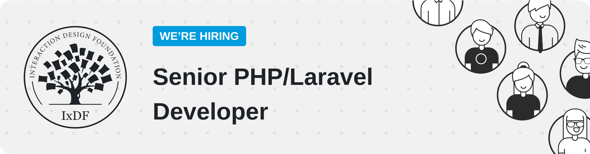
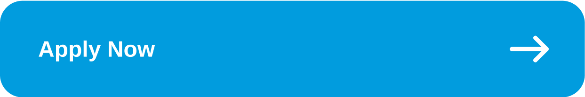
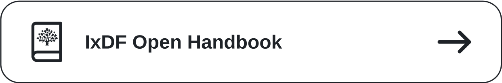

|  |  |
|---------------------------------------------------------------------------------------|----------------------------------------------------------------------------------------------|

# IxDF Who? 🤔

The Interaction Design Foundation is the **global leader in online design education**. Founded in 2002, we have over 175,000 members and counting. We hold the trust of industry giants like Adobe and IBM, who rely on our courses to train their teams.

Our founder and CEO is a developer himself, so you can bet our platform and development are in very good hands. Our platform, along with our mission, is at the very core of who we are. We don’t waste time with long-strung debates just to get our point across. Instead, we focus on the minimal distance between word and action.

Basically, we get stuff done!

# 🏠 Our Main Product

We're currently in the most exciting phase of development work at the IxDF—a special and long overdue project—**a complete platform redesign**. We're excited about this because it's something we've been looking forward to for years. Fortunately, we're well-prepared: our design system is organized and primed for enhancement, our back-end code is flawless, our front-end code is on track, and our team of developers is eager to show off their capabilities.

The IxDF web is a multi-page application—an MVC-based, modular monolith, **comprising 30+ bounded contexts**, using Laravel as a back-end framework. It was started back in 2013, and since then we’ve relentlessly **increased code quality**, features, and test coverage, and are proud to say that we have close to no legacy code because we **prioritize refactoring and adding tests**. We believe a modular monolithic architecture can reach a level of perfection if done right—despite an ever-increasing number of features.

# ⚙️ Our Stack

#UseThePlatform. We focus on enduring technologies over the latest fleeting frameworks so that our developers' knowledge continually grows instead of becoming outdated after each trend has passed. This philosophy allows us to build robust, maintainable, and beautiful code that stands the test of time rather than chasing the latest hype. Some of our key technologies include: 

- Always latest PHP and Laravel versions
- Modular monolith comprising 30+ bounded contexts
- Laravel ecosystem: Horizon, Nova, Scout, Pennant, Passport, Inertia, and more
- Web Components, Htmx, Tailwind, Vue.js, Inertia.js, Vite
- Server: Docker, Sail, Octane, Forge, nginx
- DBs: MySQL 8, Redis
- Testing: PHPUnit, Pest, Cypress
- Advanced CI/CD: GitHub actions, Deployer, Bash
- Code Quality: Psalm, PHPStan, Rector, PHPCS, PHP CS Fixer
- Integrations: Stripe, PayPal, Amazon Pay, Twilio, Mailgun, MailerLite, GitHub, Forge, Coconut, ImageKit, and more 
- Cloud: AWS, Digital Ocean
- APM & Monitoring: NewRelic, CloudWatch, BugSnag, GTMetrix 

We love to delegate boring tasks to our non-human colleagues—like static analyzers (Psalm, PHPStan, Rector), bots, scripts, and test code.

# 🛠 Our Code Conventions and Dev Handbook
 - [IxDF PHP Conventions](https://handbook.interaction-design.org/library/backend/conventions--php.html)
 - [IxDF Laravel Conventions](https://handbook.interaction-design.org/library/backend/conventions--laravel.html)
 - [IxDF JavaScript Conventions](https://handbook.interaction-design.org/library/frontend/conventions--js.html)
 - [Dev handbook](https://handbook.interaction-design.org/)

# 🌎 Remote Work. Real Impact.

We were an all-remote organization before that term even existed. In fact, we’ve been perfecting remote work for 22 years! You can count on having full control of your schedule to block out focus time for deep concentration work. Your gender or ethnicity bear no significance on your work—only your output does! So those who are truly passionate about their craft with a bias towards action thrive in our environment. 

*“One can choose to go back toward safety or forward toward growth. Growth must be chosen again and again; fear must be overcome again and again. — Abraham Maslow*

# ❤️ Why Devs Love to Work With Us

Ever wish your CEO encouraged you to write more automated tests? Or even just understood their importance? Want to work where clean code isn't a luxury but a priority?

As we mentioned before, our founder and CEO is a developer himself, and our **elegant code** is the vein that keeps our company healthy and growing. You'll never have to advocate for the importance of investing in code quality. You can save time (and frustrations) and spend it on doing what matters in a **healthy, collaborative environment where your ideas, energy, and time are valued.** Devs are involved in all cycles of software development, including decision-making, so there are **incredible opportunities to take initiative**, make meaningful contributions, and grow. Forget political struggles or long, pointless debates. 

Our development team is a highly motivated group of exceptional minds constantly innovating. We share a common purpose, and like Mandalorian groups, we are insular and selective. But our door is always open to truly outstanding developers with unique and irreplaceable skills. 

Have we described you to a tee? If so, we’d love to hear from you!

# 🔥 A Culture of 110% Excellence and 100% Remote Work 

We believe our platform and community will make the world a better place and we’re on a mission to make a (massive) dent in the universe.

It’s not for the faint of code.

If you’re ready for the challenge, head to our careers page to learn more about our culture and open positions: https://www.interaction-design.org/about/careers
